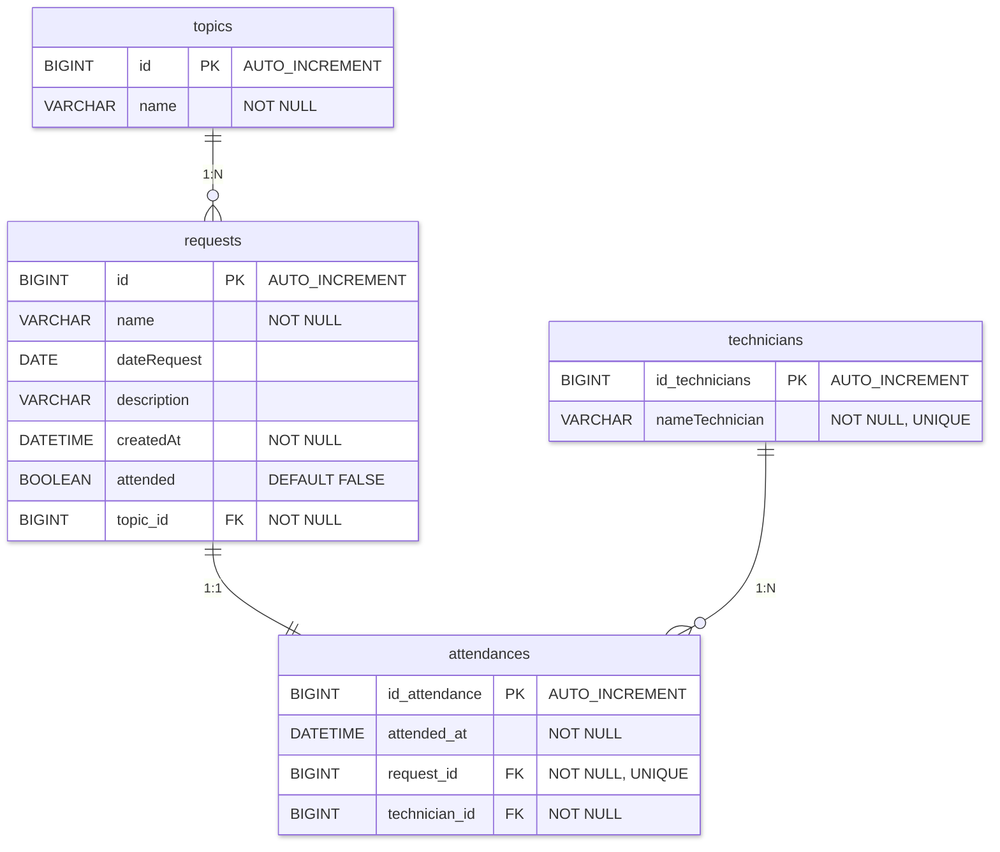

# Suport App
## Descripción del Proyecto 🛠️

Este proyecto es una **API RESTful** para la gestión de solicitudes en un sistema de mesa de ayuda. Permite a los usuarios crear y gestionar peticiones de soporte (`requests`), asignarlas a temas (`topics`), y llevar un registro de las atenciones (`attendances`) realizadas por los técnicos (`technicians`). La arquitectura se basa en el patrón **Service-Repository-Controller** y utiliza **Data Transfer Objects (DTOs)** para desacoplar las capas de la aplicación.

 

## Características Principales ✨

* **Gestión de Solicitudes (Requests):** Crea, lee y gestiona peticiones de soporte.  
* **Gestión de Temas (Topics):** Categoriza las peticiones para una mejor organización.  
* **Gestión de Técnicos (Technicians):** Administra los técnicos responsables de atender las solicitudes.  
* **Registro de Atenciones (Attendances):** Marca una solicitud como atendida y registra qué técnico la completó.  
* **API RESTful:** Endpoints claros y bien definidos para cada funcionalidad.  
* **Manejo de Excepciones:** Gestión personalizada de errores para respuestas claras (por ejemplo, `404 Not Found`).   

 

## Tecnologías Utilizadas 🚀
- Java 21 SE
- Spring & Spring Boot
- Spring Data JPA
- Database: H2s.
 
  
## Estructura Entidad-Relación

 

## Diagrama de clases

```mermaid
classDiagram
    direction BT

    class RuntimeException {
    }

    class AttendanceController {
        - IAttendanceService service
        + markAsAttended(dtoRequest)
    }

    class AttendanceDTORequest {
        - LocalDateTime attendedAt
        - Long request
        - Long technician
    }

    class AttendanceDTOResponse {
        - Long id
        - LocalDateTime attendedAt
        - Long request
        - Long technician
    }

    class AttendanceEntity {
        - Long id
        - LocalDateTime attendedAt
        - RequestEntity request
        - TechnicianEntity technician
    }

    class AttendanceMapper {
        + toEntity(dtoRequest, request, technician)
        + toDTO(entity)
    }

    class IAttendanceService {
        + markAsAttended(dtoRequest)
    }

    class AttendanceServiceImpl {
        - AttendanceRepository attendanceRepository
        - RequestRepository requestRepository
        - TechnicianRepository technicianRepository
        + markAsAttended(dtoRequest)
    }

    class RequestController {
        - IGenericService service
        + getEntities()
        + storeEntity(dtoRequest)
        + getRequestShortedByDate()
        + show(id)
    }

    class RequestDTORequest {
        - String name
        - LocalDate dateRequest
        - Long topicId
        - String description
        - boolean attended
    }

    class RequestDTOResponse {
        - Long id
        - String name
        - LocalDate dateRequest
        - TopicEntity topic
        - String description
        - LocalDateTime created_at
        - boolean attended
    }

    class RequestEntity {
        - Long id
        - String name
        - LocalDate dateRequest
        - String description
        - LocalDateTime createdAt
        - TopicEntity topic
        - boolean attended
        + prePersist()
    }

    class RequestExceptions {
        + RequestExceptions(message)
        + RequestExceptions(message, cause)
    }

    class RequestMapper {
        + toEntity(dtoRequest, topic)
        + toDTO(entity)
    }

    class RequestNotFoundExceptions {
        + RequestNotFoundExceptions(message)
        + RequestNotFoundExceptions(message, cause)
    }

    class RequestRepository {
    }

    class RequestServiceImpl {
        - RequestRepository repository
        - TopicRepository topicRepository
        + getEntities()
        + storeEntity(dtoRequest)
        + getEntitiesSortedByDate()
        + getEntityById(id)
    }

    class TechnicianController {
        - ITechnicianService technicianService
        + getEntities()
        + storeEntity(dtoRequest)
        + show(id)
    }

    class TechnicianDTORequest {
        - String name
    }

    class TechnicianDTOResponse {
        - Long id
        - String name
    }

    class TechnicianEntity {
        - Long id
        - String nameTechnician
    }

    class TechnicianExceptions {
        + TechnicianExceptions(message)
        + TechnicianExceptions(message, cause)
    }

    class TechnicianMapper {
        + toDTO(entity)
        + toEntity(dto)
    }

    class TechnicianNotFoundExceptions {
        + TechnicianNotFoundExceptions(message)
        + TechnicianNotFoundExceptions(message, cause)
    }

    class TechnicianRepository {
    }

    class TechnicianServiceImpl {
        - TechnicianRepository repository
        + storeEntity(dto)
        + getEntities()
        + getEntityById(id)
    }

    class TopicController {
        - ITopicService service
        + getAllTopics()
        + getTopicById(id)
    }

    class TopicDTOResponse {
        - Long id
        - String name
    }

    class TopicEntity {
        - Long id
        - String name
    }

    class TopicExceptions {
        + TopicExceptions(message)
        + TopicExceptions(message, cause)
    }

    class TopicMapper {
        + toDTO(topic)
    }

    class TopicNotFoundExceptions {
        + TopicNotFoundExceptions(message)
        + TopicNotFoundExceptions(message, cause)
    }

    class TopicRepository {
    }

    class TopicServiceImpl {
        - TopicRepository repository
        + getAllEntities()
        + getEntityById(id)
    }

    class IGenericService {
        + getEntities()
        + storeEntity(dto)
        + getEntityById(id)
        + getEntitiesSortedByDate()
    }

    class ITechnicianService {
        + getEntities()
        + storeEntity(dto)
        + getEntityById(id)
    }

    class ITopicService {
        + getAllEntities()
        + getEntityById(id)
    }

    RequestExceptions <|-- RequestNotFoundExceptions : extends
    RuntimeException <|-- RequestExceptions : extends
    TechnicianExceptions <|-- TechnicianNotFoundExceptions : extends
    RuntimeException <|-- TechnicianExceptions : extends
    TopicExceptions <|-- TopicNotFoundExceptions : extends
    RuntimeException <|-- TopicExceptions : extends

    RequestServiceImpl ..|> IGenericService : implements
    TechnicianServiceImpl ..|> ITechnicianService : implements
    TopicServiceImpl ..|> ITopicService : implements
    AttendanceServiceImpl ..|> IAttendanceService : implements

    RequestController o-- IGenericService : has-a
    TechnicianController o-- ITechnicianService : has-a
    TopicController o-- ITopicService : has-a
    AttendanceController o-- IAttendanceService : has-a

    RequestServiceImpl o-- RequestRepository : uses
    RequestServiceImpl o-- TopicRepository : uses
    TechnicianServiceImpl o-- TechnicianRepository : uses
    TopicServiceImpl o-- TopicRepository : uses
    AttendanceServiceImpl o-- AttendanceRepository : uses
    AttendanceServiceImpl o-- RequestRepository : uses
    AttendanceServiceImpl o-- TechnicianRepository : uses

    RequestMapper ..> RequestDTORequest : maps to
    RequestMapper ..> RequestDTOResponse : maps to
    RequestMapper ..> RequestEntity : maps to
    TechnicianMapper ..> TechnicianDTORequest : maps to
    TechnicianMapper ..> TechnicianDTOResponse : maps to
    TechnicianMapper ..> TechnicianEntity : maps to
    TopicMapper ..> TopicDTOResponse : maps to
    TopicMapper ..> TopicEntity : maps to
    AttendanceMapper ..> AttendanceDTORequest : maps to
    AttendanceMapper ..> AttendanceDTOResponse : maps to
    AttendanceMapper ..> AttendanceEntity : maps to

    RequestEntity "1" *-- "1" TopicEntity : "tiene"
    AttendanceEntity "1" *-- "1" RequestEntity : "atiende"
    AttendanceEntity "1" *-- "1" TechnicianEntity : "atendida por"

    RequestDTOResponse "1" -- "1" TopicEntity : "contiene"
```

 

## Documentation with Swagger
<http://localhost:8080/swagger-ui/index.html>

 

## Postman 
[Postman collection](https://paulasteam-2.postman.co/workspace/Team-Workspace~deffa7c9-6c86-4c9c-8a40-821d2c31b554/collection/47928928-d91219c0-85f4-4ca6-b011-e251b2991cf7?action=share&source=copy-link&creator=47928928)

 

## Test

